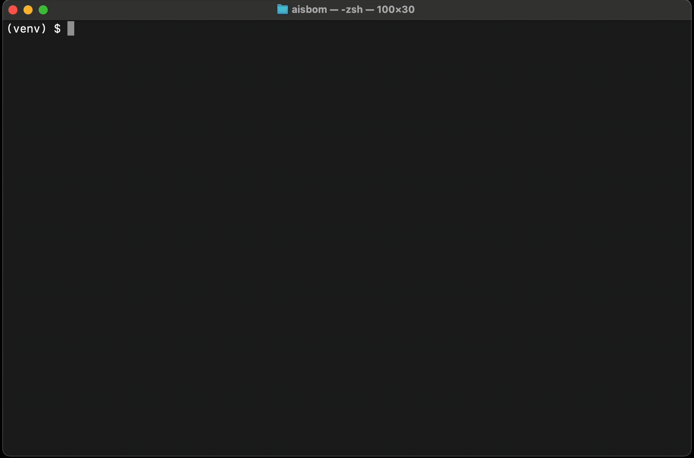

# AIsbom: The Supply Chain for Artificial Intelligence

[](https://pypi.org/project/aisbom-cli/)


**AIsbom** is a specialized security and compliance scanner for Machine Learning artifacts.
- **SPDX 2.3**: Standard SBOM format for industry compliance.
- **CycloneDX**: Supported (Default output format).

Install via **Pip** or download our **standalone, air-gapped binary** for USB/offline audits.

Unlike generic SBOM tools that only parse `requirements.txt`, AIsbom performs **Deep Binary Introspection** on model files (`.pt`, `.pkl`, `.safetensors`, `.gguf`) to detect malware risks and legal license violations hidden inside the serialized weights.



---

## Quick Start

### 1. Installation
Install directly from PyPI. No cloning required.

```bash
pip install aisbom-cli
```
*Note: The package name is `aisbom-cli`, but the command you run is `aisbom`.*

### 1a. Standalone Binary (Air-Gapped)
For environments where installing Python is not possible, download the single-file executable from our [Releases page](https://github.com/Lab700xOrg/aisbom/releases/latest).

**Available Binaries:**
*   `aisbom-linux-amd64` (Linux x86_64)
*   `aisbom-macos-amd64` (macOS Intel)
*   `aisbom-macos-arm64` (macOS Silicon M1/M2/M3)

#### Installation & Troubleshooting (macOS)
Due to Apple's strict security policies for unsigned binaries, you must explicitly allow the application to run.

```bash
# 1. Make the binary executable
chmod +x aisbom-macos-*

# 2. Remove the "Quarantine" attribute (Fixes "Unidentified Developer" error)
xattr -d com.apple.quarantine aisbom-macos-*

# 3. Run it
./aisbom-macos-arm64 --help
```

*Why is `xattr` needed?*
macOS tags downloaded files with a "quarantine" attribute. Since our open-source binary is not code-signed with an Apple Developer ID, Gatekeeper will block it by default. The `xattr -d` command removes this tag, allowing the binary to execute on your machine.
*   **Zero Dependencies**: Everything is bundled.
*   **Portable**: Runs on bare metal servers.

### 2. Run a Local Scan
Point it at any directory containing your ML project. It scans recursively for requirements files AND binary model artifacts.

```bash
aisbom scan ./my-project-folder
```

### 3. The Output
You will see a combined Security & Legal risk assessment in your terminal:

```text
                           🧠 AI Model Artifacts Found                           
┏━━━━━━━━━━━━━━━━━━━━━┳━━━━━━━━━━━━━┳━━━━━━━━━━━━━━━━━━━━━━┳━━━━━━━━━━━━━━━━━━━━━━━━━━━━━┓
┃ Filename            ┃ Framework   ┃ Security Risk        ┃ Legal Risk                  ┃
┡━━━━━━━━━━━━━━━━━━━━━╇━━━━━━━━━━━━━╇━━━━━━━━━━━━━━━━━━━━━━╇━━━━━━━━━━━━━━━━━━━━━━━━━━━━━┩
│ bert_finetune.pt    │ PyTorch     │ CRITICAL (RCE Found) │ UNKNOWN                     │
│ safe_model.st       │ SafeTensors │ LOW                  │ UNKNOWN                     │
│ restricted_model.st │ SafeTensors │ LOW                  │ LEGAL RISK (cc-by-nc-4.0)   │
│ llama-3-quant.gguf  │ GGUF        │ LOW                  │ LEGAL RISK (cc-by-nc-sa)    │
└─────────────────────┴─────────────┴──────────────────────┴─────────────────────────────┘
```

A compliant `sbom.json` (CycloneDX v1.6) including SHA256 hashes and license data will be generated in your current directory.

---

## Advanced Usage

### Remote Scanning (Hugging Face)
Scan models directly on Hugging Face **without downloading** terabytes of weights. We use HTTP Range requests to inspect headers over the wire.

```bash
aisbom scan hf://google-bert/bert-base-uncased
```
*   **Speed:** Scans in seconds, not minutes.
*   **Storage:** Zero disk usage.
*   **Security:** Verify "SafeTensors" compliance before you even `git clone`.

### Config Drift Detection
Detect "Silent Regressions" in your AI Supply Chain. The `diff` command compares your current SBOM against a known baseline JSON.

```bash
aisbom diff baseline_sbom.json new_sbom.json
```

**Drift Analysis Output:**

```text
┏━━━━━━━━━━━━━━━┳━━━━━━━━━━┳━━━━━━━━━┳━━━━━━━━━━━━━━━━┳━━━━━━━━━━━━━━━━━┳━━━━━━━━━━━━━━━━┓
┃ Component     ┃ Type     ┃ Change  ┃ Security Risk  ┃ Legal Risk      ┃ Details        ┃
┡━━━━━━━━━━━━━━━╇━━━━━━━━━━╇━━━━━━━━━╇━━━━━━━━━━━━━━━━╇━━━━━━━━━━━━━━━━━╇━━━━━━━━━━━━━━━━┩
│ drift-risk.pt │ Modified │ DRIFT   │ LOW ->         │ -               │                │
│               │          │         │ CRITICAL       │                 │                │
│ drift-license │ Modified │ DRIFT   │ -              │ UNKNOWN ->      │ Lic: MIT ->    │
│               │          │         │                │ LEGAL RISK      │ CC-BY-NC       │
│ drift-hash.pt │ Modified │ DRIFT   │ INTEGRITY FAIL │ -               │ Hash: ...      │
└───────────────┴──────────┴─────────┴────────────────┴─────────────────┴────────────────┘
```

It enforces Quality Gates by exiting with **code 1** if:
*   A new **CRITICAL** risk is introduced.
*   A Component's risk level escalates (e.g., LOW -> CRITICAL).
*   **Hash Drift**: A verified file has been tampered with (Marked as INTEGRITY FAIL).

### Strict Mode (Allowlisting)
For high-security environments, switch from "Blocklisting" (looking for malware) to "Allowlisting" (blocking everything unknown).

```bash
aisbom scan model.pkl --strict
```

This will report **any** import that is not in the safe-list.
**Allowed Libraries**: `torch` (and submodules), `numpy`, `collections`, `typing`, `datetime`, `re`, `pathlib`, `copy`, `functools`, `dataclasses`, `uuid`.
**Allowed Builtins**: `dict`, `list`, `set`, `tuple`, `int`, `float`, `str`, `bytes`, etc., etc.).
*   Flags *any* unknown global import as `CRITICAL`.

### Migration Readiness (PyTorch weights_only=True)
Prepare your models for the upcoming PyTorch security defaults. PyTorch 2.6+ will default to `weights_only=True`, which breaks many legacy models.

```bash
aisbom scan model.pt --lint
```

The `--lint` flag activates the Migration Linter, which statically simulates the unpickling stack to predict runtime failures without executing code.

### Strategy: Defense in Depth

AIsbom advocates for a two-layer security approach:

1.  **Layer 1 (Pre-Execution):** Use `aisbom scan --lint` to statically analyze the file structure. This catches 99% of obvious malware and incompatible globals without ever loading the file.
2.  **Layer 2 (Runtime Isolation):** If you *must* load a model that uses `REDUCE` or unsafe globals (common in legacy files), do not run it on bare metal.
    *   **Recommendation:** Use [Sandboxed Execution](docs/sandboxed-execution.md) (e.g., `uvx` + `amazing-sandbox`) to contain any potential RCE.

> [!TIP]
> **Why both?** Static analysis is fast but can be tricked by complex obfuscation. Runtime sandboxing is secure but slow. Together, they provide speed and safety.

**It detects:**
*   **Custom Class Imports**: Objects that are not in the PyTorch default allowlist.
*   **Unsafe Globals**: Usage of `posix.system` or other unsafe modules.

**Output:**
```text
🛡️  Migration Readiness (weights_only=True)
┏━━━━━━━━━━━━━━━━┳━━━━━━━━━━━━━━━━━━━━━━━━━━━━━━━┳━━━━━━━━━━━━━━━━━━━━━━━━━━━━━━━━━━━━━━━━┓
┃ File           ┃ Issue                         ┃ Recommendation                         ┃
┡━━━━━━━━━━━━━━━━╇━━━━━━━━━━━━━━━━━━━━━━━━━━━━━━━╇━━━━━━━━━━━━━━━━━━━━━━━━━━━━━━━━━━━━━━━━┩
│ mock_broken.pt │ Custom Class Import Detected: │ Module 'aisbom' is not in PyTorch      │
│                │ aisbom.mock.Layer             │ default allowlist. Use                 │
│                │                               │ `torch.serialization.add_safe_globals` │
│                │                               │ .                                      │
└────────────────┴───────────────────────────────┴────────────────────────────────────────┘
```

### Markdown Reporting (CI/CD)
Generate a GitHub-flavored Markdown report suitable for Pull Request comments.

```bash
aisbom scan . --format markdown --output report.md
```

### SPDX Export (Enterprise Compliance)
Generate SPDX 2.3 Software Bill of Materials.

```bash
aisbom scan . --format spdx --output sbom.spdx.json
```

---

## CI/CD Integration

Add AIsbom to your GitHub Actions pipeline.
**Behavior:** The scanner returns `exit code 1` if Critical risks are found, automatically blocking the build/merge.

```yaml
name: AI Security Scan
on: [pull_request]

jobs:
  aisbom-scan:
    runs-on: ubuntu-latest
    steps:
      - uses: actions/checkout@v4
      
      - name: Scan AI Models
        uses: Lab700xOrg/aisbom@v0
        with:
          directory: '.'
```

---

## Visualize the Report
Don't like reading JSON? You can visualize your security posture using our **offline** viewer.

1.  Run the scan to generate `sbom.json`.
2.  Go to [aisbom.io/viewer.html](https://aisbom.io/viewer.html).
3.  Drag and drop your JSON file.
4.  Get an instant dashboard of risks, license issues, and compliance stats.

*Note: The viewer is client-side only. Your SBOM data never leaves your browser.*

---

## Why AIsbom?

AI models are not just text files; they are executable programs and IP assets.

*   **The Security Risk:** PyTorch (`.pt`) files are Zip archives containing Pickle bytecode. A malicious model can execute arbitrary code (RCE) instantly when loaded.
*   **The Legal Risk:** A developer might download a "Non-Commercial" model (CC-BY-NC) and deploy it to production. Since the license is hidden inside the binary header, standard tools miss it.
*   **The Solution:** **We look inside.** We decompile bytecode and parse internal metadata headers without loading the heavy weights into RAM.

---

## How to Verify (The "Trust Factor")

Security tools require trust. **We do not distribute malicious binaries.**

However, AIsbom includes a built-in generator so you can create safe "mock artifacts" to verify the scanner works.

**1. Install:**
```bash
pip install aisbom-cli
```

**2. Generate Test Artifacts:**
Run this command to create a mock "Pickle Bomb" and a "Restricted License" model in your current folder.
```bash
aisbom generate-test-artifacts
```
*Result: Files named `mock_malware.pt`, `mock_restricted.safetensors`, `mock_restricted.gguf`, and `mock_broken.pt` are created.*

**3. Scan them:**
```bash
aisbom scan .
```
*Result: You will see `mock_malware.pt` flagged as **CRITICAL**, legal risks flagged, and if you run with `--lint`, `mock_broken.pt` will appear in the Migration Readiness table.*

---

## Security Logic Details
AIsbom uses a static analysis engine to disassemble Python Pickle opcodes. It looks for specific `GLOBAL` and `STACK_GLOBAL` instructions that reference dangerous modules:
*   `os` / `posix` (System calls)
*   `subprocess` (Shell execution)
*   `builtins.eval` / `exec` (Dynamic code execution)
*   `socket` (Network reverse shells)