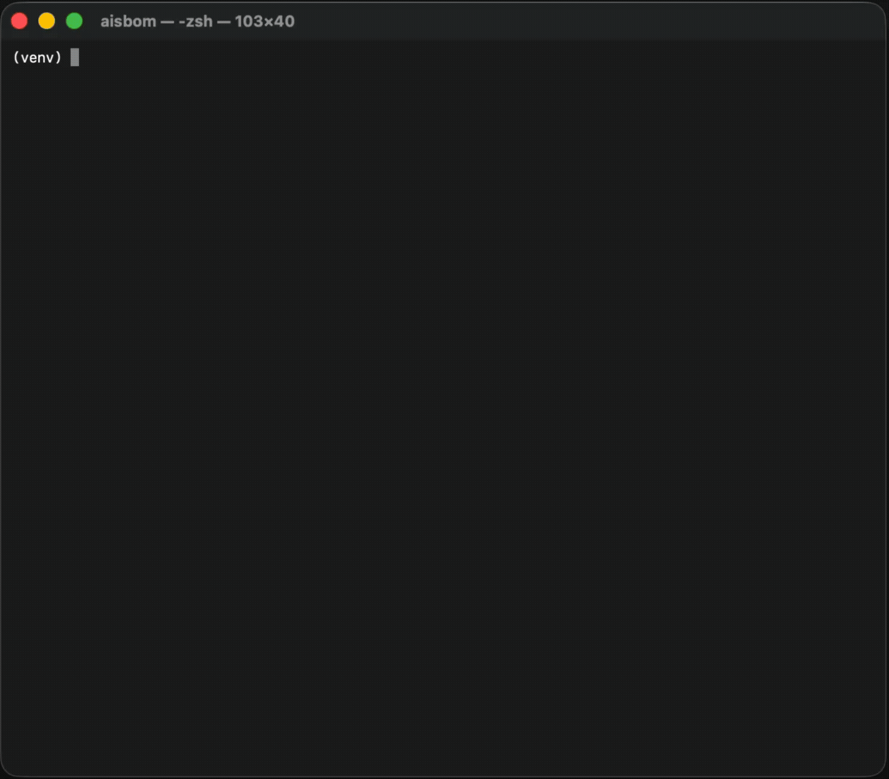
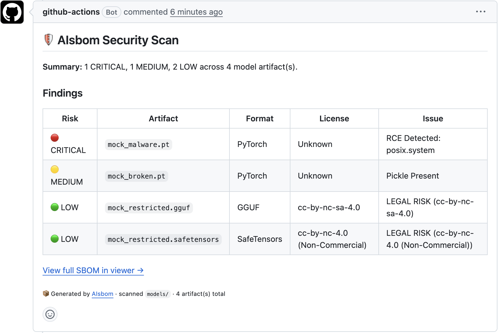
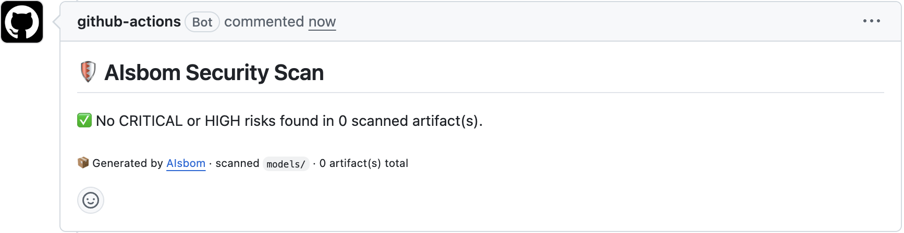

# AIsbom: The Supply Chain for Artificial Intelligence

[](https://pypi.org/project/aisbom-cli/)
[](https://github.com/marketplace/actions/aisbom-security-scanner)


**Detect malware and license risks hidden inside ML model files — statically, before you load them.**

AIsbom disassembles Pickle bytecode and parses SafeTensors / GGUF binary headers to surface RCE-capable payloads and restrictive licenses that generic SBOM tools miss. Pure static analysis — no model code is ever executed.

> 💡 Also available as a [**GitHub Action**](#use-as-a-github-action) that posts an idempotent PR comment on every commit. See it on the [Marketplace →](https://github.com/marketplace/actions/aisbom-security-scanner)



---

## Try it in one command

Zero-install — [pipx](https://pipx.pypa.io/) fetches the latest release, runs it, then cleans up:

```bash
pipx run --spec aisbom-cli aisbom scan hf://google-bert/bert-base-uncased
```

That scans BERT directly **over HTTP**, without downloading 400 MB of weights to disk. You'll see a security + legal risk table in your terminal and a `sbom.json` file in your current directory. 

**Want to see the same scan visualized?** [Open the live demo →](https://aisbom.io/?ref=cli-readme)

For persistent install:

```bash
pipx install aisbom-cli           # or: pip install aisbom-cli
aisbom scan hf://google-bert/bert-base-uncased
```

> The PyPI package name is `aisbom-cli`, but the command you run is `aisbom`. That's why `pipx run` needs `--spec aisbom-cli`.

---

## What it finds

A typical scan against a project with mixed artifacts:

```text
                           🧠 AI Model Artifacts Found                           
┏━━━━━━━━━━━━━━━━━━━━━┳━━━━━━━━━━━━━┳━━━━━━━━━━━━━━━━━━━━━━┳━━━━━━━━━━━━━━━━━━━━━━━━━━━━━┓
┃ Filename            ┃ Framework   ┃ Security Risk        ┃ Legal Risk                  ┃
┡━━━━━━━━━━━━━━━━━━━━━╇━━━━━━━━━━━━━╇━━━━━━━━━━━━━━━━━━━━━━╇━━━━━━━━━━━━━━━━━━━━━━━━━━━━━┩
│ bert_finetune.pt    │ PyTorch     │ CRITICAL (RCE Found) │ UNKNOWN                     │
│ safe_model.st       │ SafeTensors │ LOW                  │ UNKNOWN                     │
│ restricted_model.st │ SafeTensors │ LOW                  │ LEGAL RISK (cc-by-nc-4.0)   │
│ llama-3-quant.gguf  │ GGUF        │ LOW                  │ LEGAL RISK (cc-by-nc-sa)    │
└─────────────────────┴─────────────┴──────────────────────┴─────────────────────────────┘
```

A compliant `sbom.json` (CycloneDX v1.6) including SHA256 hashes and license data is generated in your working directory. SPDX 2.3 export is one flag away (`--format spdx`).

Don't like reading JSON? [Open the viewer →](https://aisbom.io/viewer?ref=cli-readme), drag your `sbom.json` in, and get an instant dashboard of risks, license issues, and compliance stats. *The viewer is client-side only — your data never leaves your browser.*

---

## Install

| Method | Best for |
|---|---|
| `pipx run --spec aisbom-cli aisbom ...` | Trying it without committing |
| `pipx install aisbom-cli` | Daily use; isolated venv |
| `pip install aisbom-cli` | Python projects with their own venv |
| [Standalone binary](https://github.com/Lab700xOrg/aisbom/releases/latest) | Air-gapped / offline / no-Python environments |

### Standalone binaries

Single-file executables for Linux x86_64, macOS Intel, and macOS Silicon. Download from the [Releases page](https://github.com/Lab700xOrg/aisbom/releases/latest). Zero dependencies. Runs on bare metal.

📚 [How to Audit Air-Gapped / Offline Systems](docs/air-gapped-guide.md)

#### macOS quarantine note

macOS tags downloaded files with a "quarantine" attribute, and unsigned open-source binaries get blocked by Gatekeeper. Run once:

```bash
chmod +x aisbom-macos-*
xattr -d com.apple.quarantine aisbom-macos-*
./aisbom-macos-arm64 --help
```

---

## Common workflows

### Scan a Hugging Face model

```bash
aisbom scan hf://google-bert/bert-base-uncased
```

We use HTTP Range requests to inspect just the headers — scans complete in seconds and use zero disk. Verify SafeTensors compliance before you `git clone`.

### Share a scan with your team

```bash
aisbom scan ./my-project-folder --share
```

Generates a hosted, shareable link. The SBOM is uploaded to `aisbom.io` and remains viewable for 30 days. You'll be prompted to confirm before upload (use `--share-yes` to skip the prompt in CI).

### Detect drift between two scans

```bash
aisbom diff baseline_sbom.json new_sbom.json
```

Exits with **code 1** when:
- A new **CRITICAL** risk is introduced
- A component's risk level escalates (e.g., LOW → CRITICAL)
- A verified file's hash changes (marked **INTEGRITY FAIL**)

```text
┏━━━━━━━━━━━━━━━┳━━━━━━━━━━┳━━━━━━━━━┳━━━━━━━━━━━━━━━━━━━━━━┳━━━━━━━━━━━━━━━━━━━━┳━━━━━━━━━━━━━━━━┓
┃ Component     ┃ Type     ┃ Change  ┃ Security Risk        ┃ Legal Risk         ┃ Details        ┃
┡━━━━━━━━━━━━━━━╇━━━━━━━━━━╇━━━━━━━━━╇━━━━━━━━━━━━━━━━━━━━━━╇━━━━━━━━━━━━━━━━━━━━╇━━━━━━━━━━━━━━━━┩
│ drift-risk.pt │ Modified │ DRIFT   │ LOW → CRITICAL       │ -                  │                │
│ drift-license │ Modified │ DRIFT   │ -                    │ UNKNOWN →          │ Lic: MIT →     │
│               │          │         │                      │ LEGAL RISK         │ CC-BY-NC       │
│ drift-hash.pt │ Modified │ DRIFT   │ INTEGRITY FAIL       │ -                  │ Hash: ...      │
└───────────────┴──────────┴─────────┴──────────────────────┴────────────────────┴────────────────┘
```

### Strict mode (allowlist)

For high-security environments, switch from blocklisting (looking for known-bad imports) to allowlisting (blocking everything unknown):

```bash
aisbom scan model.pkl --strict
```

Allowed modules: `torch` (and submodules), `numpy`, `collections`, `typing`, `datetime`, `re`, `pathlib`, `copy`, `functools`, `dataclasses`, `uuid`. Any unknown global import is flagged **CRITICAL**.

### Migration readiness (`weights_only=True`)

PyTorch 2.6+ defaults to `weights_only=True`, which breaks many legacy models:

```bash
aisbom scan model.pt --lint
```

The Migration Linter statically simulates the unpickling stack to predict runtime failures without executing code.

```text
🛡️  Migration Readiness (weights_only=True)
┏━━━━━━━━━━━━━━━━┳━━━━━━━━━━━━━━━━━━━━━━━━━━━━━━━┳━━━━━━━━━━━━━━━━━━━━━━━━━━━━━━━━━━━━━━━━┓
┃ File           ┃ Issue                         ┃ Recommendation                         ┃
┡━━━━━━━━━━━━━━━━╇━━━━━━━━━━━━━━━━━━━━━━━━━━━━━━━╇━━━━━━━━━━━━━━━━━━━━━━━━━━━━━━━━━━━━━━━━┩
│ mock_broken.pt │ Custom Class Import Detected: │ Module 'aisbom' is not in PyTorch      │
│                │ aisbom.mock.Layer             │ default allowlist. Use                 │
│                │                               │ `torch.serialization.add_safe_globals` │
└────────────────┴───────────────────────────────┴────────────────────────────────────────┘
```

### Markdown report (CI/CD)

```bash
aisbom scan . --format markdown --output report.md
```

Generates a GitHub-flavored Markdown report suitable for PR comments and CI artifacts.

### SPDX 2.3 export (enterprise compliance)

```bash
aisbom scan . --format spdx --output sbom.spdx.json
```

---

## Use as a GitHub Action

Scan ML artifacts on every PR and post a single idempotent comment summarizing findings, with a link to the hosted viewer:

```yaml
# .github/workflows/aisbom.yml
name: AIsbom Security Scan
on:
  pull_request:
    paths: ['models/**', 'requirements.txt']

permissions:
  contents: read
  pull-requests: write    # required for the PR comment

jobs:
  aisbom:
    runs-on: ubuntu-latest
    steps:
      - uses: actions/checkout@v4
      - uses: Lab700xOrg/aisbom@v1
        with:
          directory: models/
```

When CRITICAL or HIGH findings are detected, the Action posts a comment like this:



When the scan is clean, the comment collapses to a one-line ✅:



Re-runs update the same comment in place via a hidden `<!-- aisbom-action -->` marker — you'll never see stacked AIsbom comments on the same PR.

See [`action/README_ACTION.md`](action/README_ACTION.md) for the full inputs/outputs reference, permissions block, and troubleshooting.

---

## Try it on a real pickle bomb

Don't trust the scanner? Scan a bomb yourself. AIsbom ships a built-in mock-malware generator so you can confirm the scanner catches a real RCE payload (and that it's not just lighting up false positives on safe files).

```bash
# 1. Generate the mock artifacts
aisbom generate-test-artifacts

# 2. Scan them
aisbom scan .
```

You'll see `mock_malware.pt` flagged as **CRITICAL**, license issues flagged on the restricted models, and (with `--lint`) `mock_broken.pt` appear in the Migration Readiness table.

---

## Defense in Depth

AIsbom advocates for a two-layer approach:

1. **Layer 1 — Pre-execution.** `aisbom scan --lint` statically analyzes the file structure. Catches obvious malware and incompatible globals without ever loading the file.
2. **Layer 2 — Runtime isolation.** If you *must* load a model with `REDUCE` opcodes or unsafe globals (common in legacy files), don't run it on bare metal. Use [Sandboxed Execution](docs/sandboxed-execution.md) (e.g., `uvx` + `amazing-sandbox`) to contain any potential RCE.

> [!TIP]
> **Why both?** Static analysis is fast but can be defeated by complex obfuscation. Runtime sandboxing is secure but slow. Together, they give you speed *and* safety.

---

## Why AIsbom?

AI models aren't just text files — they're executable programs and IP assets.

- **The security risk.** PyTorch (`.pt`) files are Zip archives containing Pickle bytecode. A malicious model executes arbitrary code (RCE) the moment it's loaded.
- **The legal risk.** A developer might download a "non-commercial" model (e.g., CC-BY-NC) and ship it to production. The license is embedded in the binary header — standard SBOM tools miss it entirely.
- **The solution.** AIsbom looks *inside*. We decompile bytecode and parse binary metadata headers without loading the heavy weights into memory.

---

## How it works

AIsbom uses a static analysis engine to disassemble Python Pickle opcodes. It looks for specific `GLOBAL` and `STACK_GLOBAL` instructions referencing dangerous modules:

- `os` / `posix` (system calls)
- `subprocess` (shell execution)
- `builtins.eval` / `exec` (dynamic code execution)
- `socket` (network reverse shells)

SafeTensors and GGUF use binary formats with structured headers — AIsbom parses these headers directly to extract metadata (artifact names, license info, architecture details) without loading tensor weights.

For weekly scan findings on the top 50 most-downloaded Hugging Face text-generation models, see [aisbom.io/advisories](https://aisbom.io/advisories?ref=cli-readme).

---

## Telemetry & Privacy

AIsbom collects a small amount of anonymous usage telemetry — what model formats people scan, how often critical findings appear, whether scans run in CI — to help us prioritize what to build. We treat this with the same care we expect from any security tool. Read what we collect, then opt out if you'd rather not participate.

### What's collected

Per `aisbom scan`: `target_type` (the **bucket**: `local` / `huggingface` / `http` / `https` — never the actual path or URL), `model_format` (the file-type bucket), `risk_level_max`, `scan_duration_ms`, `file_count`, `parse_error_count`, `strict_mode`. A `cli_scan_critical_found` event with a count is added when at least one CRITICAL is found.

If you explicitly use `--share`: the generated `sbom.json` document is uploaded to our servers and retained for 30 days to generate the shareable viewer link. A `cli_share_created` event is fired tracking whether `has_share_yes=true|false`.

Per `aisbom diff`: a `cli_diff` event with `has_drift=true|false`.

On unhandled exceptions: a `cli_error` event records the exception class name only (e.g. `JSONDecodeError`) — never the message, traceback, or any file content.

Each event carries an anonymous `user_id` — a SHA-256 of your machine's MAC address plus an app salt, truncated to 16 hex chars. Stored in `~/.aisbom/config.json`. Lets us see returning users without identifying anyone.

### What's never collected

File paths, directory contents, model names, target URLs, file hashes from your SBOMs, exception messages, tracebacks, or anything that could identify you, your project, or your organization.

### Opt out

Set `AISBOM_NO_TELEMETRY=1`. This wins over every other setting — telemetry will not fire and `~/.aisbom/config.json` will not be written.

```bash
# Permanent
export AISBOM_NO_TELEMETRY=1

# Single invocation
AISBOM_NO_TELEMETRY=1 aisbom scan ./my-project
```

### Where the data goes

Events POST to `https://api.aisbom.io/v1/telemetry` (a Cloudflare Worker we operate), which sanitizes the payload and forwards to Google Analytics 4 on the dedicated `cli.aisbom.io` data stream. We don't share, sell, or use this data for ad targeting.

### CI environments

When `CI=true` or `GITHUB_ACTIONS=true`, the `cli_install_first_seen` event is suppressed (containers are ephemeral and would otherwise spam the metric). Other events still fire, tagged `is_ci=true`.

### Status

As of **0.9.1**, telemetry is **on by default**. `AISBOM_NO_TELEMETRY=1` is the single opt-out lever and is honored on every code path. The previous `AISBOM_TELEMETRY_V2=1` opt-in flag was retired once the rollout soak completed — setting it today is a harmless no-op.

---

## Links

- [aisbom.io](https://aisbom.io/?ref=cli-readme) — landing page + live viewer demo
- [Live SBOM viewer](https://aisbom.io/viewer?ref=cli-readme) — drag-and-drop dashboard
- [Public advisories](https://aisbom.io/advisories?ref=cli-readme) — weekly scans of the top 50 HF models
- [Changelog](https://aisbom.io/changelog?ref=cli-readme) — release history with RSS feed
- [GitHub Marketplace](https://github.com/marketplace/actions/aisbom-security-scanner) — the Action listing

---

*Built with ❤️ in Austin.*
