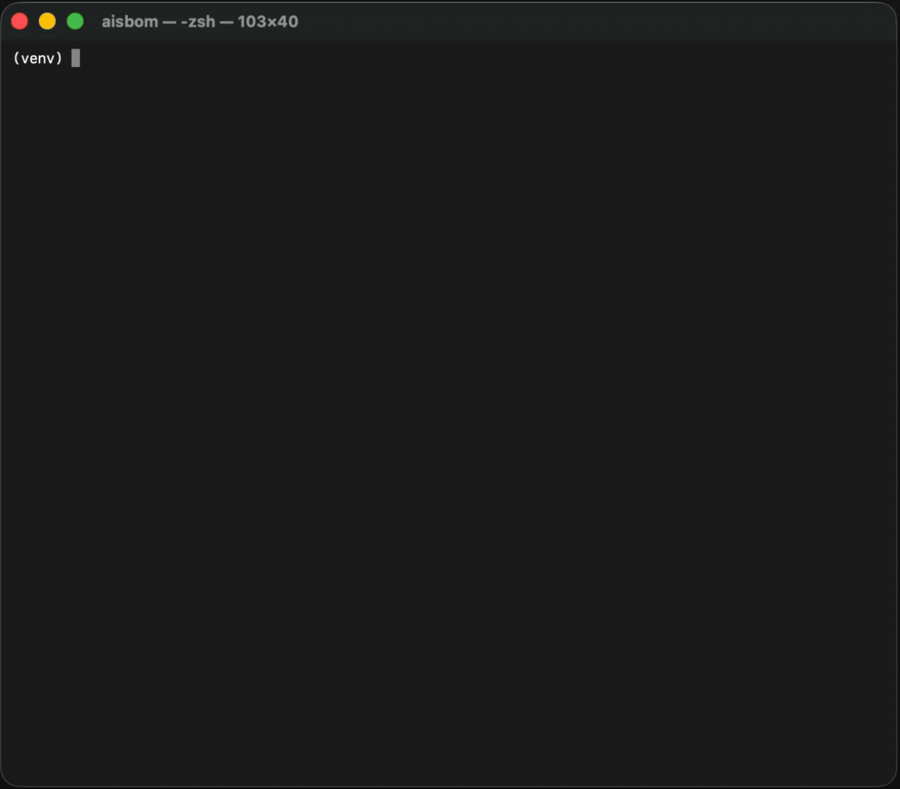
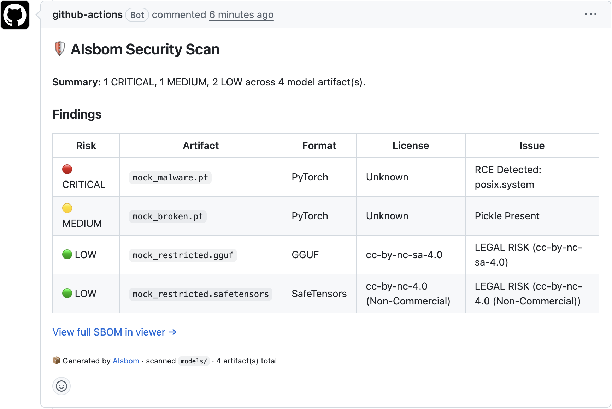
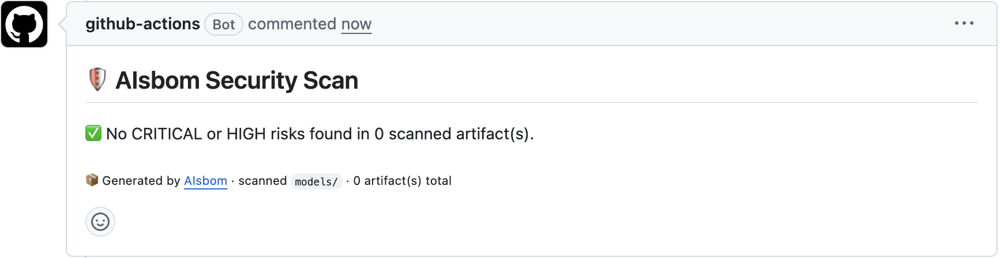

# AIsbom: The Supply Chain for Artificial Intelligence

[](https://pypi.org/project/aisbom-cli/)
[](https://github.com/marketplace/actions/aisbom-security-scanner)


**Detect malware and license risks hidden inside ML model files — statically, before you load them.**

AIsbom disassembles Pickle bytecode, inspects Keras configs for code-executing `Lambda` layers, reads GGUF chat templates for Jinja sandbox escapes, walks ONNX graphs for custom operators and escaping external-data paths, and parses SafeTensors / GGUF binary headers — surfacing RCE-capable payloads and restrictive licenses that generic SBOM tools miss. Pure static analysis: **no model is ever loaded, and no payload is ever executed, rendered, or unmarshalled.**

> 💡 Also available as a [**GitHub Action**](#use-as-a-github-action) that posts an idempotent PR comment on every commit. See it on the [Marketplace →](https://github.com/marketplace/actions/aisbom-security-scanner)



---

## Try it in one command

Zero-install — [pipx](https://pipx.pypa.io/) fetches the latest release, runs it, then cleans up:

```bash
pipx run --spec aisbom-cli aisbom scan hf://google-bert/bert-base-uncased
```

That scans BERT directly **over HTTP**, without downloading 400 MB of weights to disk. You'll see a security + legal risk table in your terminal and a `sbom.json` file in your current directory. 

**Want to see the same scan visualized?** [Open the live demo →](https://aisbom.io/?ref=cli-readme)

For persistent install:

```bash
pipx install aisbom-cli           # or: pip install aisbom-cli
aisbom scan hf://google-bert/bert-base-uncased
```

> The PyPI package name is `aisbom-cli`, but the command you run is `aisbom`. That's why `pipx run` needs `--spec aisbom-cli`.

---

## What it finds

A typical scan against a project with mixed artifacts:

```text
                                    🧠 AI Model Artifacts Found
┏━━━━━━━━━━━━━━━━━━━━━━━━━━━━━━┳━━━━━━━━━━━━━┳━━━━━━━━━━━━━━━━━━━━━━━━━━━━━━━━━━━━━━━━━━━━━━━━┳━━━━━━━━━━━━━━━━━━━━━━━━━━━━━━┓
┃ Filename                     ┃ Framework   ┃ Security Risk                                  ┃ Legal Risk                   ┃
┡━━━━━━━━━━━━━━━━━━━━━━━━━━━━━━╇━━━━━━━━━━━━━╇━━━━━━━━━━━━━━━━━━━━━━━━━━━━━━━━━━━━━━━━━━━━━━━━╇━━━━━━━━━━━━━━━━━━━━━━━━━━━━━━┩
│ bert_finetune.pt             │ PyTorch     │ CRITICAL (RCE Detected: posix.system)          │ UNKNOWN                      │
│ classifier.h5                │ Keras       │ CRITICAL (Keras Lambda Code Execution — Lambda │ UNKNOWN                      │
│                              │             │ layer(s): exfil_lambda; 1 embedded code        │                              │
│                              │             │ object(s))                                     │                              │
│ backdoored-chat.gguf         │ GGUF        │ CRITICAL (Chat Template Code Execution:        │ PASS                         │
│                              │             │ __class__, __mro__, __subclasses__)            │                              │
│ exfil.onnx                   │ ONNX        │ CRITICAL (ONNX External Data Escapes Model     │ UNKNOWN                      │
│                              │             │ Directory: ../../../etc/passwd)                │                              │
│ sklearn_pipeline.joblib      │ Joblib      │ CRITICAL (RCE Detected: posix.system)          │ UNKNOWN                      │
│ features.npy                 │ NumPy       │ CRITICAL (RCE Detected: builtins.eval)         │ UNKNOWN                      │
│ detector.onnx                │ ONNX        │ LOW                                            │ UNKNOWN                      │
│ embeddings.npy               │ NumPy       │ LOW                                            │ UNKNOWN                      │
│ llama-3-quant.gguf           │ GGUF        │ LOW                                            │ LEGAL RISK (cc-by-nc-sa-4.0) │
│ safe_model.safetensors       │ SafeTensors │ LOW                                            │ PASS                         │
│ restricted_model.safetensors │ SafeTensors │ LOW                                            │ LEGAL RISK (cc-by-nc-4.0)    │
└──────────────────────────────┴─────────────┴────────────────────────────────────────────────┴──────────────────────────────┘
```

A compliant `sbom.json` (CycloneDX v1.7 / ECMA-424) including SHA256 hashes and license data is generated in your working directory. SPDX 2.3 export is one flag away (`--format spdx`).

For `hf://` scans, each model component also carries a CycloneDX ML-BOM `modelCard` block — task, architecture family, model architecture, and training datasets, read from the model's Hugging Face metadata. Local scans get whatever the file itself declares (a GGUF header's architecture, for example) and make no extra network calls. The block is simply omitted when nothing is known.

Need the older schema for a downstream tool? `--schema-version 1.6` (or `1.5`) still works, without the `modelCard` block. One thing changed for those versions too: each model component's `bom-ref` is now a stable `artifact-<n>-<filename>` instead of a value regenerated on every run, so the same file keeps the same identifier between scans.

### Formats and what's checked in each

| Format | Extensions | What AIsbom looks for |
|---|---|---|
| **PyTorch / Pickle** | `.pt` `.pth` `.bin` `.pkl` `.pickle` | Dangerous globals in the pickle opcodes, including indirect-execution gadgets. Concatenated streams are all scanned — a legacy `torch.save` file hides its object behind three header pickles — and non-standard containers (7z, rar, xz…) are flagged. If a file is so full of streams that the walk hits its work limit, the scan says so rather than reporting clean. |
| **joblib** | `.joblib` | The pickle inside the container, whichever codec joblib chose (zlib, gzip, bz2, lzma/xz, and the legacy `ZF` format), plus uncompressed files. A payload placed *after* an array — where a real model puts its weights — is found. |
| **dill** | `.dill` | Everything the pickle path finds, plus dill's own code-reconstruction globals: a dill'd function or lambda is a marshalled code object rebuilt on load, and is reported as CRITICAL. |
| **NumPy** | `.npy` `.npz` | The pickle stream behind an `allow_pickle` object array. Each `.npz` member is opened, including ones whose checksum or header has been tampered with. |
| **Keras** | `.keras` `.h5` `.hdf5` | `Lambda` layers and embedded marshalled code objects in the model config — an actively exploited RCE vector. |
| **GGUF** | `.gguf` | License and architecture metadata, plus the embedded Jinja **chat template**, checked for sandbox-escape constructs. |
| **ONNX** | `.onnx` | Producer/opset/IR metadata, custom operators, and external-data paths that point outside the model directory. |
| **SafeTensors** | `.safetensors` | Header metadata, tensor inventory, and license. Safe by construction — no code path. |
| **Dependencies** | `requirements.txt` | Pinned packages, emitted as SBOM components. |

Don't like reading JSON? [Open the viewer →](https://aisbom.io/viewer?ref=cli-readme), drag your `sbom.json` in, and get an instant dashboard of risks, license issues, and compliance stats. *The viewer is client-side only — your data never leaves your browser.*

---

## Install

| Method | Best for |
|---|---|
| `pipx run --spec aisbom-cli aisbom ...` | Trying it without committing |
| `pipx install aisbom-cli` | Daily use; isolated venv |
| `pip install aisbom-cli` | Python projects with their own venv |
| [Standalone binary](https://github.com/Lab700xOrg/aisbom/releases/latest) | Air-gapped / offline / no-Python environments |

### Standalone binaries

Single-file executables for Linux x86_64, macOS Intel, and macOS Silicon. Download from the [Releases page](https://github.com/Lab700xOrg/aisbom/releases/latest). Zero dependencies. Runs on bare metal.

📚 [How to Audit Air-Gapped / Offline Systems](docs/air-gapped-guide.md)

#### macOS quarantine note

macOS tags downloaded files with a "quarantine" attribute, and unsigned open-source binaries get blocked by Gatekeeper. Run once:

```bash
chmod +x aisbom-macos-*
xattr -d com.apple.quarantine aisbom-macos-*
./aisbom-macos-arm64 --help
```

---

## Common workflows

### Scan targets and exit codes

`scan` accepts a directory, a single model file, a `hf://` repo, or an HTTPS URL. A directory is walked recursively; a single file is scanned on its own.

| Exit | Meaning |
|---|---|
| `0` | Scan completed, no CRITICAL risk |
| `1` | The scan could not be completed — target missing or unreadable, a file failed to parse, or a remote fetch failed |
| `2` | A **CRITICAL** risk was found (suppress with `--no-fail-on-risk`) |

`--no-fail-on-risk` governs risk findings only. An unusable target still exits `1`, so a typo'd path in CI fails loudly instead of passing as a clean scan.

### Scan a Hugging Face model

```bash
aisbom scan hf://google-bert/bert-base-uncased
```

We use HTTP Range requests to inspect just the headers — scans complete in seconds and use zero disk. Verify SafeTensors compliance before you `git clone`.

### Authentication (private & gated Hugging Face models)

To scan a **private or gated** Hugging Face model, set a Hugging Face access token in the environment. AIsbom reads `HF_TOKEN` first, then `HUGGING_FACE_HUB_TOKEN` (the same precedence as `huggingface_hub`):

```bash
export HF_TOKEN=hf_xxxxxxxxxxxxxxxxxxxx
aisbom scan hf://your-org/private-model
```

The token is sent **only** to `huggingface.co` as a bearer credential on the model-metadata requests; it is dropped on the redirect to the presigned LFS CDN and is never attached to any other host. It is **never written to logs and never included in telemetry** — the only token-related field we emit is a `token_present` boolean (whether *a* token was set), never the value itself. See [Telemetry & Privacy](#telemetry--privacy).

In CI, supply the token from a secret and make sure the runner can reach Hugging Face:

```yaml
jobs:
  scan:
    runs-on: ubuntu-latest
    steps:
      - run: pip install aisbom-cli
      - run: aisbom scan hf://your-org/private-model
        env:
          HF_TOKEN: ${{ secrets.HF_TOKEN }}
```

> **Egress note:** hosted/firewalled CI runners must allow outbound HTTPS to `huggingface.co` **and** its LFS CDN (`cdn-lfs.huggingface.co` and the presigned object-storage hosts it redirects to). A blocked CDN hop surfaces as a network/timeout error, not an auth failure.

If the **same scan keeps failing identically** (common in unattended cron/CI jobs pointed at a gated repo with no token), AIsbom notices: from the third consecutive identical failure it prints a loud stderr warning with the likely fix — set `HF_TOKEN` as above, or upgrade if a newer CLI has fixes for that failure mode. The counter lives in a small local state file; see [Telemetry & Privacy](#telemetry--privacy).

### Share a scan with your team

```bash
aisbom scan ./my-project-folder --share
```

Generates a hosted, shareable link. The SBOM is uploaded to `aisbom.io` and remains viewable for 30 days. You'll be prompted to confirm before upload (use `--share-yes` to skip the prompt in CI). For exactly what the uploaded document contains, see [Telemetry & Privacy](#telemetry--privacy).

### Detect drift between two scans

```bash
aisbom diff baseline_sbom.json new_sbom.json
```

Exits with **code 1** when:
- A new **CRITICAL** risk is introduced
- A component's risk level escalates (e.g., LOW → CRITICAL)
- A verified file's hash changes (marked **INTEGRITY FAIL**)

```text
┏━━━━━━━━━━━━━━━┳━━━━━━━━━━┳━━━━━━━━━┳━━━━━━━━━━━━━━━━━━━━━━┳━━━━━━━━━━━━━━━━━━━━┳━━━━━━━━━━━━━━━━┓
┃ Component     ┃ Type     ┃ Change  ┃ Security Risk        ┃ Legal Risk         ┃ Details        ┃
┡━━━━━━━━━━━━━━━╇━━━━━━━━━━╇━━━━━━━━━╇━━━━━━━━━━━━━━━━━━━━━━╇━━━━━━━━━━━━━━━━━━━━╇━━━━━━━━━━━━━━━━┩
│ drift-risk.pt │ Modified │ DRIFT   │ LOW → CRITICAL       │ -                  │                │
│ drift-license │ Modified │ DRIFT   │ -                    │ UNKNOWN →          │ Lic: MIT →     │
│               │          │         │                      │ LEGAL RISK         │ CC-BY-NC       │
│ drift-hash.pt │ Modified │ DRIFT   │ INTEGRITY FAIL       │ -                  │ Hash: ...      │
└───────────────┴──────────┴─────────┴──────────────────────┴────────────────────┴────────────────┘
```

### Strict mode (allowlist)

For high-security environments, switch from blocklisting (looking for known-bad imports) to allowlisting (blocking everything unknown):

```bash
aisbom scan model.pkl --strict
```

Allowed modules: `torch` (and submodules), `numpy`, `collections`, `typing`, `datetime`, `re`, `pathlib`, `copy`, `functools`, `dataclasses`, `uuid`. Any unknown global import is flagged **CRITICAL**.

### Migration readiness (`weights_only=True`)

PyTorch 2.6+ defaults to `weights_only=True`, which breaks many legacy models:

```bash
aisbom scan model.pt --lint
```

The Migration Linter statically simulates the unpickling stack to predict runtime failures without executing code.

```text
🛡️  Migration Readiness (weights_only=True)
┏━━━━━━━━━━━━━━━━┳━━━━━━━━━━━━━━━━━━━━━━━━━━━━━━━┳━━━━━━━━━━━━━━━━━━━━━━━━━━━━━━━━━━━━━━━━┓
┃ File           ┃ Issue                         ┃ Recommendation                         ┃
┡━━━━━━━━━━━━━━━━╇━━━━━━━━━━━━━━━━━━━━━━━━━━━━━━━╇━━━━━━━━━━━━━━━━━━━━━━━━━━━━━━━━━━━━━━━━┩
│ mock_broken.pt │ Custom Class Import Detected: │ Module 'aisbom' is not in PyTorch      │
│                │ aisbom.mock.Layer             │ default allowlist. Use                 │
│                │                               │ `torch.serialization.add_safe_globals` │
└────────────────┴───────────────────────────────┴────────────────────────────────────────┘
```

### Markdown report (CI/CD)

```bash
aisbom scan . --format markdown --output report.md
```

Generates a GitHub-flavored Markdown report suitable for PR comments and CI artifacts.

### SPDX 2.3 export (enterprise compliance)

```bash
aisbom scan . --format spdx --output sbom.spdx.json
```

---

## Use as a GitHub Action

Scan ML artifacts on every PR and post a single idempotent comment summarizing findings, with a link to the hosted viewer:

```yaml
# .github/workflows/aisbom.yml
name: AIsbom Security Scan
on:
  pull_request:
    paths: ['models/**', 'requirements.txt']

permissions:
  contents: read
  pull-requests: write    # required for the PR comment

jobs:
  aisbom:
    runs-on: ubuntu-latest
    steps:
      - uses: actions/checkout@v4
      - uses: Lab700xOrg/aisbom@v1
        with:
          directory: models/
```

When CRITICAL or HIGH findings are detected, the Action posts a comment like this:



When the scan is clean, the comment collapses to a one-line ✅:



Re-runs update the same comment in place via a hidden `<!-- aisbom-action -->` marker — you'll never see stacked AIsbom comments on the same PR.

### Hosted dashboard (optional)

The PR comment shows you each scan; the hosted dashboard at [app.aisbom.io](https://app.aisbom.io) keeps the history. Set the optional `token` input and every scan's SBOM is posted to your inventory dashboard, where you can browse artifacts across repos and branches, track drift over time, and share an executive view with compliance stakeholders:

```yaml
      - uses: Lab700xOrg/aisbom@v1
        with:
          directory: models/
          token: ${{ secrets.AISBOM_TOKEN }}
```

Get a per-repo token at <https://app.aisbom.io/connect> (sign in with GitHub). Leave `token` unset and the Action stays purely local — nothing is sent to the dashboard.

#### Data flow & privacy

When (and only when) `token` is set, the Action POSTs the generated CycloneDX SBOM JSON to `https://app.aisbom.io/v1/scan-result`, along with the branch/tag name (`GITHUB_REF_NAME`) so the dashboard can attribute results to the right ref. That's the entire payload: the SBOM describes the *structure and findings* of your model files (names, hashes, licenses, risk levels) — never the weights or file contents, which don't leave the GitHub runner. Data is stored in the EU (Cloudflare R2/D1, EU jurisdiction). Every upload is announced in a loud log group in your CI output, so your logs always show when a network call happened and where the data went. To stop uploading, remove the `token` input — there is no background or implicit sending.

See [`action/README_ACTION.md`](action/README_ACTION.md) for the full inputs/outputs reference, permissions block, and troubleshooting.

---

## Try it on a real pickle bomb

Don't trust the scanner? Scan a bomb yourself. AIsbom ships a built-in mock-malware generator so you can confirm the scanner catches a real RCE payload (and that it's not just lighting up false positives on safe files).

```bash
# 1. Generate the mock artifacts
aisbom generate-test-artifacts

# 2. Scan them
aisbom scan .
```

You'll see `mock_malware.pt` flagged as **CRITICAL**, license issues flagged on the restricted models, and (with `--lint`) `mock_broken.pt` appear in the Migration Readiness table.

---

## Does AIsbom catch known scanner bypasses?

Most of them — and the ones it doesn't are published rather than hidden. Run the scorecard and see for yourself:

```bash
aisbom bypass-scorecard
```

This rebuilds a corpus of publicly-documented pickle-evasion techniques — the nullifAI 7z and broken-stream tricks, Sonatype's four picklescan CVEs, JFrog's three zero-days, ShadowPickle, and the Checkmarx `bdb.Bdb.run` gadget — scans each one, and prints what was caught in blocklist mode and in `--strict`.

The results are published verbatim in [docs/bypass-scorecard.md](docs/bypass-scorecard.md), including the cases we only **partially** catch — where the file is refused but the payload was never disassembled, so the reason you're given isn't the real one. Static analysis is not magic, and a scanner that only advertises its wins isn't worth trusting; the corpus is the regression gate that keeps a fixed case from silently coming back.

There's a full write-up of the table, why each partial is a decision rather than an oversight, and the miss that until recently reported "No AI models found" on a directory carrying a reverse shell, at **[Does AIsbom catch it?](https://aisbom.io/blog/does-aisbom-catch-it)**.

Two principles come out of that corpus and shape how the pickle path behaves:

- **A file that can't be parsed cleanly is still scanned.** Truncating a stream, corrupting a ZIP's CRC-32, or making a member's local-header filename disagree with the central directory are all evasions *because* the loaders that matter don't check, while scanners bail out. AIsbom disassembles from the front of the stream regardless, and reads a member straight from its local header when the archive refuses to open it properly.
- **What a file contains decides its verdict, not what it looks like.** A protocol-0 pickle is printable ASCII, so classifying by shape let a bare pickle calling `os.system` pass as a text config file. Candidates are disassembled first and classified afterwards.

One documented limit: a model repacked in a **non-standard container** (7z, rar, xz, zstd…) is reported CRITICAL and the container format is named, but the payload inside is *not* unpacked and therefore not itemized. Unpacking 7z would put a compression stack and its native dependencies into every install and every standalone binary; the container choice is treated as the finding instead. The scorecard shows this case as ⚠️ partial rather than claiming a detection it hasn't made.

The corpus is synthesized, never copied from live malware — every artifact carries a harmless `echo` where real malware would carry a payload, and the harness proves it never executes what it scans. See [tests/corpus/README.md](tests/corpus/README.md).

---

## Defense in Depth

AIsbom advocates for a two-layer approach:

1. **Layer 1 — Pre-execution.** `aisbom scan --lint` statically analyzes the file structure. Catches obvious malware and incompatible globals without ever loading the file.
2. **Layer 2 — Runtime isolation.** If you *must* load a model with `REDUCE` opcodes or unsafe globals (common in legacy files), don't run it on bare metal. Use [Sandboxed Execution](docs/sandboxed-execution.md) (e.g., `uvx` + `amazing-sandbox`) to contain any potential RCE.

> [!TIP]
> **Why both?** Static analysis is fast but can be defeated by complex obfuscation. Runtime sandboxing is secure but slow. Together, they give you speed *and* safety.

---

## Why AIsbom?

AI models aren't just text files — they're executable programs and IP assets.

- **The security risk.** PyTorch (`.pt`) files are Zip archives containing Pickle bytecode. A malicious model executes arbitrary code (RCE) the moment it's loaded.
- **The legal risk.** A developer might download a "non-commercial" model (e.g., CC-BY-NC) and ship it to production. The license is embedded in the binary header — standard SBOM tools miss it entirely.
- **The solution.** AIsbom looks *inside*. We decompile bytecode and parse binary metadata headers without loading the heavy weights into memory.

---

## How it works

AIsbom uses a static analysis engine to disassemble Python Pickle opcodes. It looks for specific `GLOBAL` and `STACK_GLOBAL` instructions referencing dangerous modules:

- `os` / `posix` / `nt` (system calls)
- `subprocess` (shell execution)
- `builtins.eval` / `exec` / `__import__` (dynamic code execution)
- `socket` (network reverse shells)

It also covers **indirect-execution gadgets** — the "benign-looking module, dangerous method" pairs that reach the same sinks without naming them:

- `bdb` / `pdb` — a debugger's `run`, `runeval` and `runcall` compile and execute a supplied string
- `asyncio` — subprocess transports and event-loop run methods
- `pip.main`, `runpy`, `importlib`, `imp` — installing or importing as a way to execute
- `pty`, `platform.popen`, `multiprocessing`, `ctypes` — process spawning and native library loading
- `code` / `codeop` / `timeit` / `cProfile` — helpers that take code as a string
- `operator.methodcaller` — reaches a sink without ever naming it as a global

Two rules generalize the list, so the *next* gadget doesn't need to be enumerated first: a dangerous package governs its submodules (an unlisted `asyncio.*` module is still judged as `asyncio`), and an execution-shaped attribute name (`.run`, `.system`, `.popen`, `.import_module`) is flagged whatever module it arrives through — including on otherwise-trusted packages.

Attribute names are matched **exactly, never as substrings**, so ordinary globals like `torch.storage._load_from_bytes` are untouched. Every entry above was checked against the globals a genuine checkpoint carries (`torch._utils._rebuild_tensor_v2`, `collections.OrderedDict`, `numpy.core.multiarray._reconstruct`, …) — a scanner that flags real models is one people switch off, which is a worse outcome than a missed case.

### Beyond pickle

Pickle is not the only way a model file gets code to run. Each of the other formats has its own vector, and each is read as inert data:

**joblib, dill and NumPy object arrays** (`.joblib`, `.dill`, `.npy`, `.npz`) are pickle underneath — the everyday serialization of scikit-learn and scientific Python, carrying exactly the arbitrary-code-execution risk of a `.pt`, and opened by almost nothing that calls itself an SBOM tool. AIsbom reads them without importing joblib, dill or numpy: the compression is standard-library, the `.npy` header is parsed by hand, and nothing is ever unpickled.

Two things about these formats are worth stating plainly:

- **A raw array block does not end the scan.** joblib writes its pickle up to an array, dumps the raw buffer inline, then resumes pickling — which stops an opcode disassembly dead a few hundred bytes into the file. Since every real model has weights, "after the first array" is the natural place for a payload. The remaining bytes get a second pass that recovers globals directly, so a dangerous import behind an array block is still reported. That pass reads bytes rather than structure, so it recognises *known* sinks only: in strict mode it does not contribute unrecognized-import findings, and it cannot judge a dual-use constructor like `operator.methodcaller("system")`, because the argument that decides is a stack relationship it has no stack for.
- **A declared dtype never decides whether to look.** The `.npy` header is attacker-supplied, so a pickle sitting behind a header claiming `'<f8'` would otherwise be a one-line evasion. The data section is disassembled whatever the header says. What the header *does* affect is the reported risk: an array of ordinary numbers with no pickle in it is LOW, not "pickle present".

- **No limit ends in a clean verdict.** Four bounds apply here — the file-read budget, the `.npz` member count, the decompressor's output cap, and the disassembler's stream budget — and each one leaves bytes unexamined. Hitting any of them reports `MEDIUM (Pickle Scan Incomplete)` rather than passing the prefix off as the whole file. A limit that reports "clean" is not a safety measure; it is a hiding place with a length attached. A real finding still outranks the marker.

joblib's `lz4` and `zstd` codecs have no standard-library decompressor. Following the same reasoning as 7z containers, those are **named but not opened** — `MEDIUM (Unscanned Container: lz4)` — rather than pulling a native dependency into every install and every standalone binary. That is an honest "we did not read these bytes", which is a different answer from a clean scan.

**SafeTensors and GGUF** use binary formats with structured headers — AIsbom parses these directly to extract metadata (artifact names, license info, architecture details) without loading tensor weights.

**Keras** (`.keras`, `.h5`, `.hdf5`) carries a different execution vector: a `Lambda` layer stores an arbitrary Python callable in the model config as a base64-encoded marshalled code object, and `load_model` runs it. AIsbom reads the config out of both containers — the `.keras` zip and the legacy HDF5 attribute — and flags `Lambda` layers and embedded code objects as CRITICAL. The payload is identified from its header bytes and **never unmarshalled**. A truncated or corrupted container is still scanned rather than skipped, so damaging a file is not a way to hide a payload.

**GGUF chat templates.** A GGUF model can ship a Jinja template in its metadata (`tokenizer.chat_template`). Unlike a pickle payload it isn't run when the file is opened — it runs on *every inference request*, which is what makes a hostile one worth catching: it executes as a consequence of using the model normally. AIsbom reads the template as a string and flags sandbox-escape constructs — attribute-traversal chains (`__class__`, `__subclasses__`, `__globals__`), the `|attr()` filter used to bypass attribute restrictions, and references to code-execution or OS callables — as CRITICAL. Template inclusion tags are MEDIUM, since they need a target template to matter. Models shipping several named variants (`chat_template.default`, `.tool_use`) have each one scanned. **The template is never rendered, parsed by a template engine, or compiled** — handing a hostile template to Jinja to find out whether it's hostile would be the vulnerability. Only its SHA-256 goes into the SBOM, never the template body.

**ONNX** (`.onnx`) is a protobuf message, walked directly — no ONNX runtime is imported and the graph is never executed. Alongside the metadata (producer, opset, IR version, graph name, operator inventory) it surfaces two signals:

- **External-data references.** A tensor's bytes can live outside the model file, addressed by a relative path. A path that climbs out of the model directory — or names an absolute path or a URL — is **CRITICAL**: loaders resolve and open that path, so loading a model becomes a read of a file the author chose. Paths that stay inside the directory are MEDIUM, because the model isn't self-contained and those bytes aren't covered by its hash.
- **Custom operators.** An operator outside the standard ONNX domains needs a matching custom op library registered at load time — a native-code dependency the consumer inherits. MEDIUM.

Graphs nested inside `If`, `Loop` and `Scan` nodes are walked too, since those execute. The graph walk itself is near-constant regardless of model size — bulk tensor data is stepped over rather than read, so the structure of a multi-gigabyte model is inspected about as quickly as a small one's. Total scan time still grows with file size, because every artifact is SHA-256 hashed for the SBOM, and that reads the whole file.

For weekly scan findings on the top 50 most-downloaded Hugging Face text-generation models, see [aisbom.io/advisories](https://aisbom.io/advisories?ref=cli-readme).

---

## Telemetry & Privacy

AIsbom collects a small amount of anonymous usage telemetry — what model formats people scan, how often critical findings appear, whether scans run in CI — to help us prioritize what to build. We treat this with the same care we expect from any security tool. Read what we collect, then opt out if you'd rather not participate.

### What's collected

Per `aisbom scan`: `target_type` (the **bucket**: `local` / `huggingface` / `http` / `https` — never the actual path or URL), `model_format` (the file-type bucket), `risk_level_max`, `scan_duration_ms`, `file_count`, `parse_error_count`, `strict_mode`. A `cli_scan_critical_found` event with a count is added when at least one CRITICAL is found.

If you explicitly use `--share`: the generated `sbom.json` document is uploaded to our servers and retained for 30 days to generate the shareable viewer link. That document is the **full CycloneDX SBOM** — for each scanned model it carries the file name, SHA-256 hash, detected license, and structured `aisbom:*` properties describing the file's format and scan findings (such as dangerous pickle opcodes, tensor/header metadata, model architecture details, and the assessed risk and legal status) so the hosted viewer can render per-format detail. For `hf://` scans it additionally carries the `modelCard` block described above — task, architecture, training datasets and the repo's licence/revision, all of which are already public metadata published on the model's Hugging Face page. These describe the *structure and findings* of your model files, never their weights or data. Nothing leaves your machine unless you pass `--share` and confirm the prompt (or pass `--share-yes`). A `cli_share_created` event is fired tracking whether `has_share_yes=true|false`.

Per `aisbom diff`: a `cli_diff` event with `has_drift=true|false`.

On a scan fetch failure or unhandled exception: a `cli_error` event records the exception class name only (e.g. `JSONDecodeError`), a low-cardinality `http_status` bucket (e.g. `401`, `timeout`), a `token_present` boolean (whether an `HF_TOKEN` / `HUGGING_FACE_HUB_TOKEN` was set), and a `consecutive_failures` bucket (`1`–`9` or `10+` — how many runs in a row hit the same failure shape) — never the token value, the message, the traceback, a URL, or any file content.

### Local state (no network)

To detect failure loops (see [Authentication](#authentication-private--gated-hugging-face-models)), AIsbom keeps `~/.aisbom/loop_state.json`: the failure *shape* of the last failing scan (exception class name, HTTP status bucket, target-type bucket — never a URL, repo id, or path), a consecutive-run counter, and a timestamp. This file is purely local UX state and involves no network, so it is written **even when `AISBOM_NO_TELEMETRY` is set**; it is cleared automatically when a scan of the same target class succeeds, and deleting it is always safe.

Each event carries an anonymous `user_id` — a SHA-256 of your machine's MAC address plus an app salt, truncated to 16 hex chars. Stored in `~/.aisbom/config.json`. Lets us see returning users without identifying anyone.

### What's never collected

File paths, directory contents, model names, target URLs, file hashes from your SBOMs, exception messages, tracebacks, or anything that could identify you, your project, or your organization.

### Opt out

Set `AISBOM_NO_TELEMETRY=1`. This wins over every other setting — telemetry will not fire and `~/.aisbom/config.json` will not be written. (The [local, network-free `loop_state.json`](#local-state-no-network) is the one file still maintained, since it never leaves your machine.)

```bash
# Permanent
export AISBOM_NO_TELEMETRY=1

# Single invocation
AISBOM_NO_TELEMETRY=1 aisbom scan ./my-project
```

### Where the data goes

Events POST to `https://api.aisbom.io/v1/telemetry` (a Cloudflare Worker we operate), which sanitizes the payload and forwards to Google Analytics 4 on the dedicated `cli.aisbom.io` data stream. We don't share, sell, or use this data for ad targeting.

### CI environments

When `CI=true` or `GITHUB_ACTIONS=true`, the `cli_install_first_seen` event is suppressed (containers are ephemeral and would otherwise spam the metric). Other events still fire, tagged `is_ci=true`.

### Status

As of **0.9.1**, telemetry is **on by default**. `AISBOM_NO_TELEMETRY=1` is the single opt-out lever and is honored on every code path. The previous `AISBOM_TELEMETRY_V2=1` opt-in flag was retired once the rollout soak completed — setting it today is a harmless no-op.

---

## Links

- [aisbom.io](https://aisbom.io/?ref=cli-readme) — landing page + live viewer demo
- [Live SBOM viewer](https://aisbom.io/viewer?ref=cli-readme) — drag-and-drop dashboard
- [Public advisories](https://aisbom.io/advisories?ref=cli-readme) — weekly scans of the top 50 HF models
- [Changelog](https://aisbom.io/changelog?ref=cli-readme) — release history with RSS feed
- [GitHub Marketplace](https://github.com/marketplace/actions/aisbom-security-scanner) — the Action listing

---

*Built with ❤️ in Austin.*
